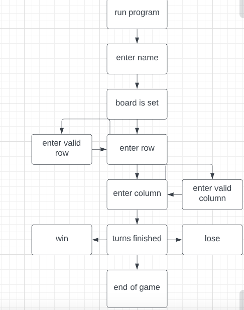
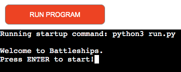
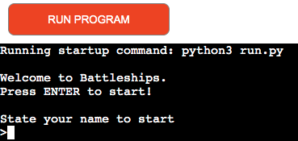
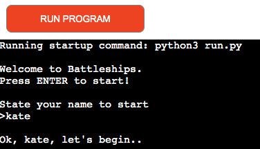
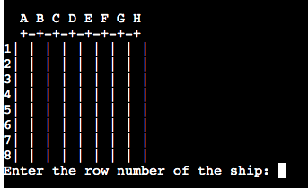
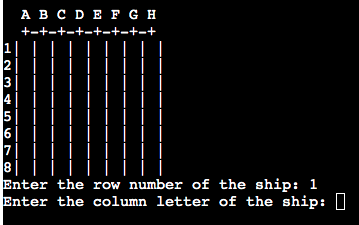
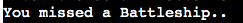
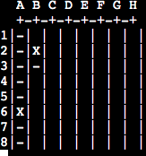
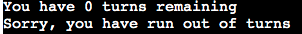

# Battleship

[Link to live site](https://battleship-battle.herokuapp.com/)

Battleship is a python based web application run in a mock terminal.
It is a game where you need to guess where the opponents ships are on a board to sink them.The person who has sunk all the ships first wins.

## User Experience:

### Vision:
- The user is welcomed at the beginning of the game and asked for their name. This inititates the start of the game. 
- The board then sets up for you to make youe first guess to try sink a ship.
- You carry on until all your turns are up and you are told whether you win or lose.

This game is easy and straightforward and no two games will be the same as the ships are randomly placed on the board thanks to a python library called random.

### Target Audience:

Battleships is targeted at anyone. Any level of player can play. It's all down to how good your guesses are.
Battleship has been around a long time and anyone of any age would appreciate it.

### User Stories

As a User:
- I want to quickly understand the purpose of the game
- Be easy to play

As a returning User:
- I want the playing method to still be easy and simple

As a site owner:
- I want to provide a fun simple game for users

## UX Plane:

1. ### Strategy:
* Build a python based web application that runs on a mock terminal
* Build a simple application with easy to follow instructions to play the game

2. ### Scope
* Build the application so that it runs on a mock terminal
* Design a simple game which is easy to follow with no previous knowledge of Batlleships

3. ### Structure
* Build the entire game in one file to play in the terminal

4. ### Skeleton

5. ### Surface
* This application should be easy to follow and not allow for empty values to be accepted

## Features
### Existing Features:

1. #### Introductory message
2. #### Press ENTER to start 

3. #### State your name to begin the game

4. #### Message telling you the game is about the start

5. #### You are asked to input your row guess

6. #### You are asked to input your column guess

7. #### You are told whether you hit or miss a battleship

8. #### Your guess whether a miss or hit is marked on the board

9. #### You are told how many turns you have remaining

10. #### You are asked for your row and column again until either you win or run out of turns
11. #### You are told you have run out of turns and the game is over

### Features to implement:

- Different types of battleships could be done
- Bigger board to accomodate ships covering more than one square and possibly at diagonals too

## Buildpacks Used:

* Heroku-Python
* Heroku-Nodejs

## Libraries Used:

* Random

## Testing

Testing was primarily done in the terminal as i built the application as this was the easy thing to do. Just play around with the code. Once deployed the application ran in the terminal with minimal errors.

The one thing i couldn't get right for a while was the width of the columns. It was incredibly narrow and too narrow to play. i resolved this by putting a space in my "" to make it " " and that made all the difference. Easy fix but took me a while to register where the problem was in the code.

## Code Validation

* The code was run through Pep8 to ensure standards were met.

## Deployment

These are the steps to deploy our project to the mock terminal in Heroku which is required:

1. on the main dashboard on the right click the "create app" button
2. click the settings tab and click on "config vars"
3. write in a KEY of "PORT" and VALUE of "8000". Click "add"
4. add the required buildpack of "python" first then "nodejs" in that order
5. click on the deploy tab. Select Github as deployment method. Connect to your profile.
6. search for the repository you want to use and click "connect"
7. chose to automatically or manually deploy your project
8. once built,click "view".

